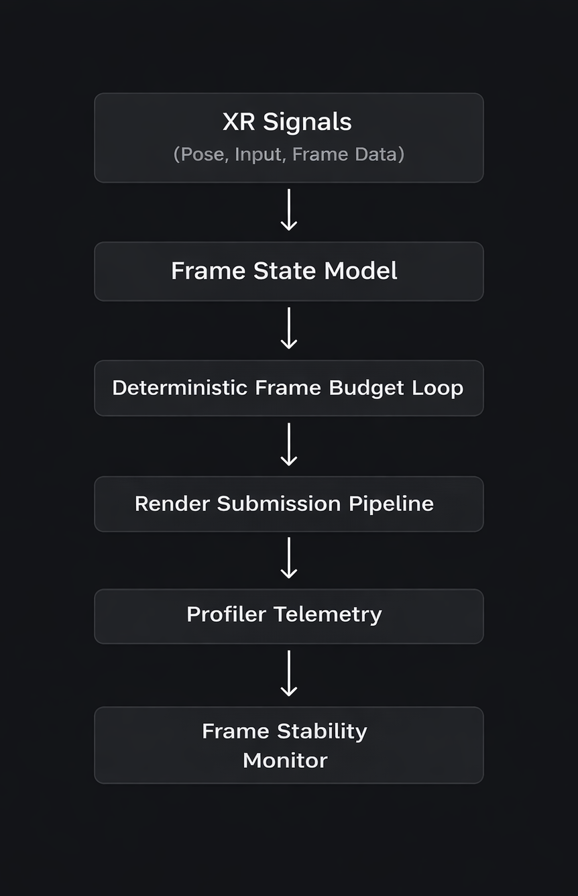

# James De Raja

## Deterministic Performance Engineering for Real-Time Systems

I design controlled experimental frameworks to isolate CPU/GPU bottlenecks and protect deterministic frame budgets in real-time systems.

---

## Core Thesis

Real-time performance is not optimized by guesswork.

It is engineered through:

- Deterministic execution models
- Controlled stress harnesses
- Reproducible profiling experiments
- Frame-time variance isolation
- Systems-level bottleneck diagnosis

Every project below reflects that philosophy.

---

## Flagship Rendering Research

### **XR Performance Lab**
Deterministic XR rendering stress framework for isolating GPU bottlenecks, overdraw amplification, and frame-time instability under controlled load.

🔗 https://github.com/JamesDeRaja/XRPerformanceLab

---

### SoftMaskPro – UI Rendering Cost Study  
Empirical performance analysis of Unity UI soft masking under layered transparency and controlled overdraw scenarios.

🔗 https://github.com/JamesDeRaja/SoftMaskPro-Performance-Study

---

## Deterministic Engineering Philosophy

Performance engineering is not about raising FPS.

It is about:

- Frame budgets defined in milliseconds
- Variance isolation
- Non-determinism elimination
- Telemetry-first system design

Architecture > Optimizations  
Measurement > Assumptions  
Determinism > Peak numbers  

---

## Systems Architecture Snapshot

---

## Portfolio

Full case studies and extended technical breakdowns:

🌐 https://james.alphaden.club
LinkedIn: https://www.linkedin.com/in/james-de-raja/
